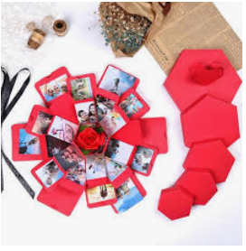

# Alekya BIllakanti
## chicken biryani
Chicken Biryani is altogether a bowl full meal consisting carbohydrates,protines and fiber.It has potential to fulfill all the requirements of a full meal single handedly.It's colourful appearance,rich garnishing,great aroma,mouth watering taste makes it more tempting.**Tasty masala and juicy meat** are the showstopper,and they decide the taste of biryani.That is why it is my favorite.

---
### Making Scrapbook Album
1. Get all the materials needed
    1. Sort your photos
3. Choose paper and embellishment
* create background with papers
* Stick them with a glue
[aboutme link](About.md)




---
### Must Visit Places in USA
The United States is made up of so many diverse destinations that it's hard to decide which place deserve the distinction of the best in America.But some of the places which I feel are must to visit and they are listed below use this for your vacation planning.
| LOCATION      | HOURS | EXPENDITURE |
|---------------|-------|-------------|
| Las Vegas     | 8     | $800        |
| Chicago       | 6     | $600        |
| San Francisco | 7     | $700        |
| New York City | 10    | $1000       |


---
### Pithy Quotes
> Nobody reaches anywhere by believing-*Osho*  
> It's always darkest before you are blinded by the light-*Josh ster*

---

### Languages
>Snowball is a small sting processing programming language designed for creating stemming algorithms for use in information retrival


language source link-<https://en.wikipedia.org/wiki/Snowball_(programming_language)>

```
import org.tartarus.snowball.ext.spanishStemmer;
...
spanishStemmer stemmer = new spanishStemmer();
stemmer.setCurrent("torero");
if (stemmer.stem()){
    System.out.println(stemmer.getCurrent());
}
```

code source link- <https://stackoverflow.com/questions/17956209/snowball-stemmer-usage>


